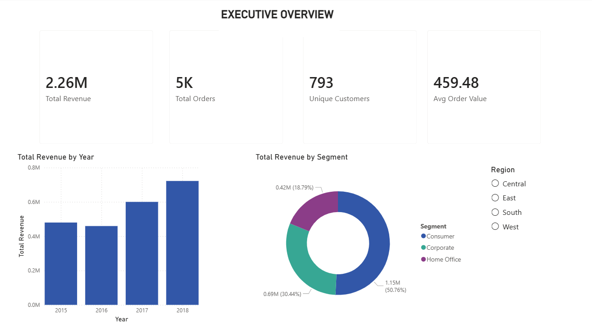
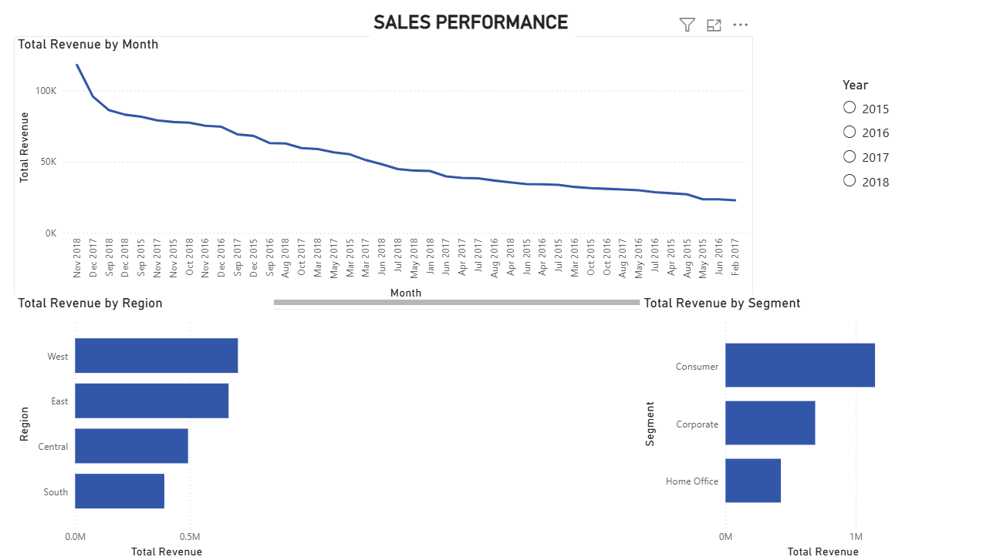
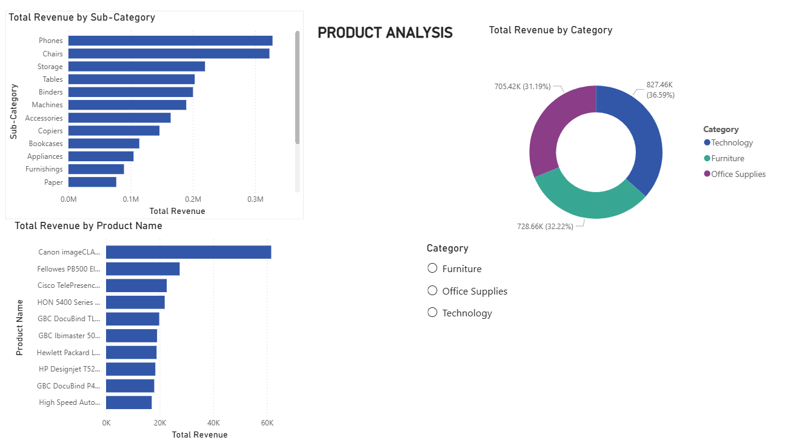
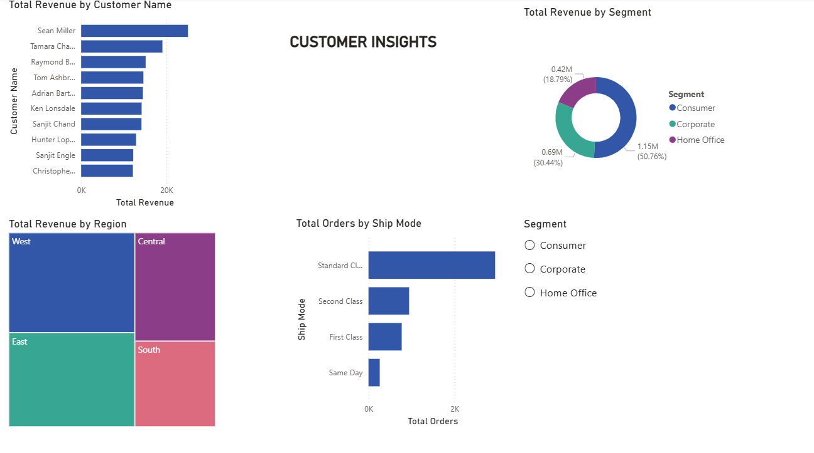

# 📊 Superstore Sales Dashboard — Power BI

> **Interactive 4-page business intelligence dashboard analyzing $2.26M in U.S. retail sales across 4 years (2015–2018), built in Power BI Desktop.**

---

## 📌 Business Problem

A U.S. retail superstore operating across four regions needs a single, interactive dashboard that gives leadership an instant view of sales performance, product trends, and customer behavior — without digging through spreadsheets.

This dashboard answers the four most important business questions:
- How is the business performing overall?
- Which regions and time periods drive the most revenue?
- Which products and categories are top performers?
- Who are our most valuable customers?

---

## 🖥️ Dashboard Pages

### Page 1 — Executive Overview
High-level KPIs giving leadership an instant business health check.



| KPI | Value |
|---|---|
| Total Revenue | $2.26M |
| Total Orders | 5,000 |
| Unique Customers | 793 |
| Avg Order Value | $459.48 |

---

### Page 2 — Sales Performance
Revenue trends over time, by region, and by customer segment.



**Key Insights:**
- Revenue grows consistently year-over-year from 2015 to 2018
- West region leads all regions in total revenue
- Consumer segment accounts for the largest share of orders

---

### Page 3 — Product Analysis
Sub-category breakdown, category distribution, and top 10 products.



**Key Insights:**
- Technology drives the highest revenue per order
- Phones and Chairs are the top performing sub-categories
- A small number of sub-categories account for the majority of revenue

---

### Page 4 — Customer Insights
Top customers, segment distribution, regional breakdown, and shipping preferences.



**Key Insights:**
- Corporate segment generates the highest revenue per customer
- Standard Class is the most used shipping mode by far
- West and East regions dominate customer distribution

---

## 🔧 Technical Details

### Data Preparation (Power Query)
- Loaded raw `train.csv` into Power BI
- Fixed date format from DD/MM/YYYY to proper Date type
- Engineered **Days to Ship** column (Ship Date - Order Date)
- Created a dedicated **Date Table** using DAX `CALENDAR()` function
- Built relationship between `Order Date` and `Date Table[Date]`

### DAX Measures Created
```
Total Revenue = SUM(train[Sales])
Total Orders = DISTINCTCOUNT(train[Order ID])
Unique Customers = DISTINCTCOUNT(train[Customer ID])
Avg Order Value = DIVIDE([Total Revenue], [Total Orders])
```

### Relationships
```
train[Order Date] → Date Table[Date] (Many to One)
```

---

## 🔧 Tech Stack


- **Power BI Desktop** — report building and publishing
- **Power Query** — data cleaning and transformation
- **DAX** — calculated measures and date intelligence
- **Dataset** — [Superstore Sales Dataset — Kaggle](https://www.kaggle.com/datasets/vivek468/superstore-dataset-final)

---

## 📁 Repository Structure

```
superstore-bi-dashboard/
├── Superstore_BI_Dashboard.pbix        # Power BI report file
├── page1_executive_overview.png        # Dashboard screenshot
├── page2_sales_performance.png         # Dashboard screenshot
├── page3_product_analysis.png          # Dashboard screenshot
├── page4_customer_insights.png         # Dashboard screenshot
└── README.md
```

---

## 🚀 How to Open

1. Download and install [Power BI Desktop](https://powerbi.microsoft.com/desktop/) (free)
2. Clone this repository
3. Open `Superstore_BI_Dashboard.pbix` in Power BI Desktop
4. All data is embedded in the file — no additional setup needed

---

## 🔗 Related Project

This dashboard is the visual complement to my **SQL analysis** of the same dataset — where I built a full RFM customer segmentation model entirely in SQL.

👉 [View the SQL Analysis Project](https://github.com/siddhant752/superstore-sql-analysis)

---

## 💡 Business Recommendations

1. **Invest in West region** — consistently the highest revenue region across all 4 years
2. **Prioritize Technology category** — highest revenue per order; expand accessories and phones
3. **Re-engage lapsed customers** — significant portion of customer base has not ordered recently
4. **Promote shipping upgrades** — majority of customers default to Standard Class
5. **Focus on Corporate segment** — generates the highest revenue per customer


---

## 👤 Author

**Siddhant Bhandari**
MS Business Analytics | Available for full-time Data Analyst / BI Analyst roles (OPT)

[](https://linkedin.com/in/siddhantb9)
[](https://github.com/siddhant752)
